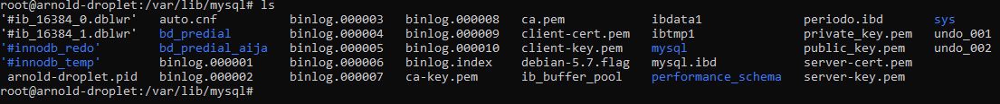
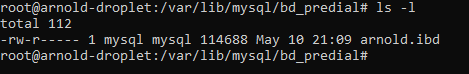

# mysql-ibd-restore
 Cuando se estropea MySQL Server y no hay forma de repararlo, una de las soluciones es desinstalar, eliminar la informacion de las bases de datos y volver a instalar desde cero. Hoy me paso a mi pero mañana te puede pasar a ti o volverme a pasar a mi :D. Esta informacion es muy util.

 Para este ejemplo se utilizo MySQL 8.0
## Paso 1
Lo primero que debes hacer es sacar una copia de los archivos .ibd que se encuentran en la carpeta convencional en caso de utilizar linux (ubuntu) se encuentra en la siguiente direccion

```
$ cd /var/lib/mysql/
```

En esta carpeta encontraras las bases de datos que posees almacenadas en carpetas

	


```
$ cd {database-name}
$ ls -l
```
y dentro encontraras los objetos (tablas) de la base de datos en archivos .ibd



deberas hacer una copia de toda la carpeta con el nombre de la base de datos incluidos sus archivos .ibd

## Paso 2

Desinstalar MySQL y limpiarla con los siguientes comandos.


```
$ sudo apt-get remove --purge mysql*
```

Limpieza y eliminacion de informacion de MySQL

```
$ sudo rm -rf /etc/mysql /var/lib/mysql
$ sudo apt-get autoremove
$ sudo apt-get autoclean
```

## Paso 3
Instalamos nuevamente MySQL Server

```
$ sudo apt install mysql-server
```

Queda a criterio de cada uno las configuraciones de seguridad para el usuario root, en este tutorial no lo realizare ya que es ageno a los objetivos de este tutorial

## Paso 4
Volvemos a la carpeta en la que nos ubicamos en un principio

```
$ cd /var/lib/mysql/
```

Como tenemos una instalacion limpia y desde cero, solo existira las bases de datos por defecto, pero ahora en esta misma ubicacion moveremos la carpeta que copiamos en el paso 1 (carpeta de base de datos como backup) y la dejaremos en este lugar.

Una vez realizado este proceso cambiaremos el propietario de los archivos al usuario mysql con el comando `chown` a la carpeta y a los archivos ibd que estan en su contenido

```
$ chown mysql:mysql {database-name}
```

una vez realizado este proceso debes asegurarte que tenga los permisos necesarios, para esto ejecutaremos el comando `chmod` a la carpeta y archivos .ibd contenidos

```
$ chown -R 755 {database-name}
```
Les recuerdo nuevamente que se debe aplicar a la carpeta y los archivos contenidos en su interior

## Paso 5
Por ultimo vamos a restablecer los tablespace de MySQL, para esto vamos a conectanos conalgun cliente, en mi caso utilizare mysql-client

```
$ mysql -u root -p
```

una vez conectado por cada tabla que tengo ejecutare el comando

```
mysql>  ALTER TABLE {database-name}.{table-name} IMPORT TABLESPACE;
```

y con eso ya deberia poder ver los registros de cada tabla.

